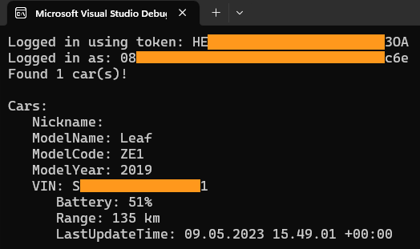

# Nissan Connect Client Library

[](https://github.com/hagronnestad/nissan-connect-dotnet/actions/workflows/main.yml) [](https://www.nuget.org/packages/NissanConnectLib)

This repository contains a C# .NET client library for the unofficial Nissan Connect API. This library is based on the great [dartnissanconnect](https://gitlab.com/tobiaswkjeldsen/dartnissanconnect)-library by [@Tobiaswk](https://github.com/Tobiaswk).

⚠️ This library supports the EU-region only. (I think?)

---

**Table of Contents**

- [Nissan Connect Client Library](#nissan-connect-client-library)
  - [Example Program](#example-program)
  - [Nuget](#nuget)
  - [Disclaimer](#disclaimer)


## Example Program

[An example program can be found here.](NissanConnect/NissanConnectLib.Example/Program.cs)

*Output preview of the example program:*




## Nuget

This library is available as a Nuget [here](https://www.nuget.org/packages/NissanConnectLib).

[](https://www.nuget.org/packages/NissanConnectLib)

*Nuget package installation commands:*
```
dotnet add package NissanConnectLib 

PM> NuGet\Install-Package NissanConnectLib

<PackageReference Include="NissanConnectLib" Version="" />
```


## Disclaimer
This library is not endorsed by, directly affiliated with, maintained, authorized, or sponsored by Nissan Motor Corporation. All product and company names are the registered trademarks of their original owners. The use of any trade name or trademark is for identification and reference purposes only and does not imply any association with the trademark holder of their product brand.
